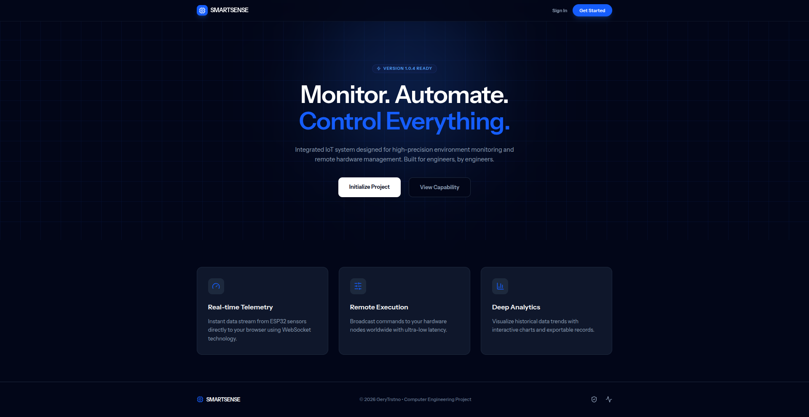
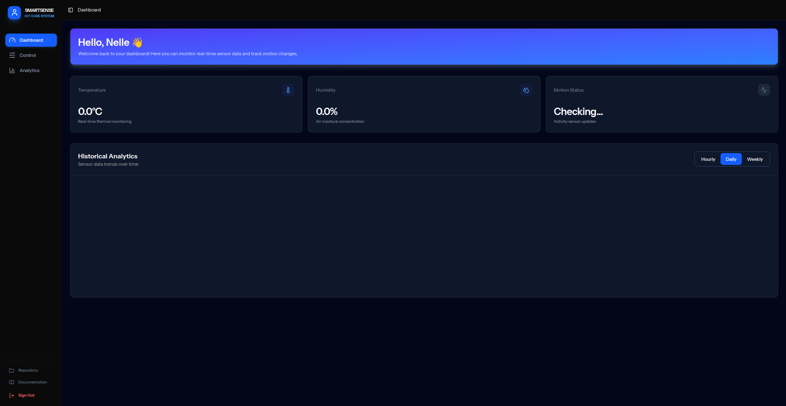
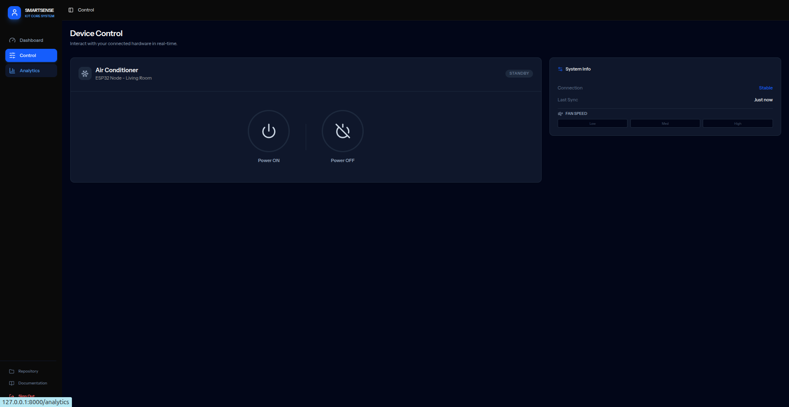

# SmartSense - IoT AC Control System v1.0.4


## 📖 Tentang Proyek

**SmartSense** adalah platform IoT terintegrasi yang dirancang untuk pemantauan lingkungan presisi tinggi dan kontrol perangkat keras jarak jauh. Proyek ini dibangun sebagai bagian dari tugas akhir Teknik Komputer, memadukan ekosistem Laravel modern dengan perangkat keras berbasis ESP32.

> "Monitor. Automate. Control Everything."

---

## 🚀 Fitur Utama

* **Real-time Telemetry**: Monitoring suhu, kelembapan, dan deteksi gerakan secara instan menggunakan WebSocket (Laravel Reverb).
* **Command Center**: Kontrol hardware (seperti AC atau Relay) secara jarak jauh dengan latensi rendah.
* **Deep Analytics**: Visualisasi tren data historis menggunakan interaktif chart dan sistem paginasi data.
* **Advanced Security**: Sistem otentikasi administrator yang aman dengan desain UI kustom yang konsisten.
* **Monochrome Blue Interface**: Antarmuka modern yang bersih, dioptimalkan untuk fokus pada data engineering.

---

## 🛠️ Tech Stack

### Web Infrastructure
* **Framework**: Laravel 12 (Backend) & React (Frontend).
* **Communication**: Laravel Reverb (WebSocket) untuk data real-time.
* **Database**: PostgreSQL.
* **Styling**: Tailwind CSS dengan konsep Custom Monochrome & Royal Blue.
* **Bridge**: Inertia.js untuk pengalaman SPA (Single Page Application).

### Hardware
* **Microcontroller**: ESP32.
* **Sensor**: DHT22, Passive Infrared.
* **Komponen**: IR Transmitter, IR Receiver.

---

## 📸 Interface Preview

<p align="center">
  Antarmuka <strong>SmartSense</strong> dirancang dengan fokus pada <em>User Experience</em> dan keterbacaan data telemetri yang presisi.
</p>

| **Landing Page** | **Main Dashboard** | **Device Control** |
| :---: | :---: | :---: |
|  |  |  |
| *Halaman depan modern untuk konversi user.* | *Monitoring Suhu, Lembab, dan Gerakan secara real-time.* | *Pusat kendali perangkat keras (IR Control).* |

<br />
---


## 🚀 Instalasi & Setup

Ikuti langkah ini untuk menjalankan proyek di komputer lokal kamu (Localhost).

### Prerequisites
* PHP >= 8.2
* Composer
* Node.js & NPM
* PostgreSQL

### Installation

1.  **Clone Repository**
    ```bash
    git clone https://github.com/GeryTrstno/SmartSense-AC-Controller.git
    cd AC-Controller
    ```

2.  **Install Dependencies**
    ```bash
    composer install
    npm install
    ```

3.  **Environment Setup**
    Duplikat file `.env.example` menjadi `.env`:
    ```bash
    cp .env.example .env
    ```
    Buka file `.env` dan sesuaikan koneksi database kamu:
    ```env
    DB_CONNECTION=pgsql
    DB_HOST=127.0.0.1
    DB_PORT=5432
    DB_DATABASE=nama_database_kamu
    DB_USERNAME=postgres
    DB_PASSWORD=password_kamu
    ```

4.  **Generate Key & Migrate**
    ```bash
    php artisan key:generate
    php artisan migrate
    ```

5.  **Run Development Server**
    Buka dua terminal terpisah:
    ```bash
    # Terminal 1 (Backend)
    php artisan serve

    # Terminal 2 (Frontend)
    npm run dev
    ```
    
    atau gunakan:
    ```bash
    composer run dev
    ```

6.  **Selesai!** Buka browser dan akses `http://127.0.0.1:8000`

---

## 🔌 Hardware Setup (Arduino IDE)

Source code untuk ESP32 terletak di direktori `/firmware/SmartSense_AC`.

### Library yang Dibutuhkan:
* **DHT sensor library** (oleh Adafruit)
* **ArduinoJson** (oleh Benoit Blanchon)
* **IRremoteESP8266** (untuk kontrol AC)
* **WebSocketsClient** (untuk koneksi real-time ke Reverb)

### Konfigurasi WiFi:
Buka file `SmartSense_AC.ino` dan sesuaikan variabel berikut:
```cpp
const char* ssid = "WIFI_KAMU";
const char* password = "PASSWORD_KAMU";
const char* host = "IP_LAPTOP_KAMU"; // Alamat Localhost
```

---

## 🛰️ Integrasi Hardware & API

Sistem menggunakan protokol HTTP untuk mengirimkan data telemetri dari ESP32 ke server Laravel. Pastikan konfigurasi endpoint pada firmware ESP32 sesuai dengan detail di bawah ini:

### 📡 Endpoint API
| Method | Endpoint | Content-Type |
| :--- | :--- | :--- |
| `POST` | `/api/sensor/store` | `application/json` |

### 📝 Payload Format (JSON)
Data dikirim dalam format objek JSON dengan struktur sebagai berikut:
```json
{
    "temperature": 25.5,
    "humidity": 60,
    "motion_detected": true
}
```

---

## Author

**GeryTrstno**  
*Computer Engineering Student*  
"Sedang menyelesaikan Thesis: Rancang Bangun Prototipe Konveyor Seleksi Tingkat Kematangan Buah Tomat Secara Otomatis Menggunakan TinyML Berbasis ESP32-CAM".*

---

<!-- Copyright © 2026 SmartSense Project. -->